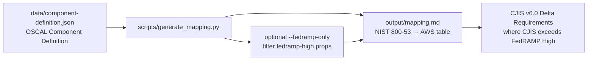

# Mapeo de NIST 800-53 Rev 5 a Servicios de AWS

Mapea los controles de seguridad de NIST 800-53 Rev 5 con los servicios de AWS que admiten su implementación, almacenados como un archivo JSON de Definición de Componentes OSCAL. Un script generador de Python renderiza el mapeo en markdown con filtrado de línea base FedRAMP High y una sección delta de CJIS v6.0 que resalta donde CJIS excede los requisitos de FedRAMP. Diseñado para ingenieros de GRC, analistas de cumplimiento y evaluadores que trabajan en entornos FedRAMP High y CJIS v6.0.

## Descripción General de la Arquitectura



Fuente de Mermaid editable (mantenida sincronizada con el bloque anterior): [`docs/architecture.mmd`](docs/architecture.mmd).

La Definición de Componentes OSCAL en `data/component-definition.json` es la fuente de mapeo legible por máquina (implementaciones de controles con propiedades de servicios de AWS, incluyendo `fedramp-high` y `cjis-delta`). `scripts/generate_mapping.py` lee ese JSON y escribe `output/mapping.md`. Pase `--fedramp-only` para emitir solo los controles de FedRAMP High; el markdown añade una sección delta de CJIS v6.0 que enumera los controles con una propiedad `cjis-delta` (bajo `--fedramp-only`, la sección delta se restringe igualmente a los controles de FedRAMP High).

## Controles de Cumplimiento Abordados

| NIST 800-53 Rev 5 | FedRAMP High | CJIS v6.0 | Método de Validación |
|--------------------|:------------:|:---------:|-------------------|
| AC-2 Gestión de Cuentas | Sí | Revisiones trimestrales de acceso CJI | Mapeo de prop OSCAL |
| AC-3 Ejecución del Acceso | Sí | — | Mapeo de prop OSCAL |
| AC-6 Privilegio Mínimo | Sí | — | Mapeo de prop OSCAL |
| AC-17 Acceso Remoto | Sí | — | Mapeo de prop OSCAL |
| AU-2 Registro de Eventos | Sí | — | Mapeo de prop OSCAL |
| AU-3 Contenido de Registros de Auditoría | Sí | — | Mapeo de prop OSCAL |
| AU-6 Revisión de Registros de Auditoría | Sí | Retención de 1 año, revisión semanal | Mapeo de prop OSCAL |
| AU-6(1) Integración Automatizada | Sí | — | Mapeo de prop OSCAL |
| AU-9 Protección de Información de Auditoría | Sí | — | Mapeo de prop OSCAL |
| AU-12 Generación de Registros de Auditoría | Sí | — | Mapeo de prop OSCAL |
| CM-2 Configuración de Línea Base | Sí | — | Mapeo de prop OSCAL |
| CM-3 Control de Cambios de Configuración | Sí | — | Mapeo de prop OSCAL |
| CM-6 Ajustes de Configuración | Sí | — | Mapeo de prop OSCAL |
| CM-7 Funcionalidad Mínima | Sí | — | Mapeo de prop OSCAL |
| CM-8 Inventario de Componentes del Sistema | Sí | — | Mapeo de prop OSCAL |
| IA-2 Identificación y Autenticación | Sí | MFA AAL2 resistente al phishing | Mapeo de prop OSCAL |
| IA-5 Gestión de Autenticadores | Sí | — | Mapeo de prop OSCAL |
| IA-8 Usuarios No Organizacionales | Sí | — | Mapeo de prop OSCAL |
| IR-4 Manejo de Incidentes | Sí | — | Mapeo de prop OSCAL |
| IR-5 Monitoreo de Incidentes | Sí | — | Mapeo de prop OSCAL |
| IR-6 Reporte de Incidentes | Sí | Reporte a la División CJIS del CSO/FBI | Mapeo de prop OSCAL |
| SC-7 Protección de Perímetro | Sí | — | Mapeo de prop OSCAL |
| SC-8 Confidencialidad de Transmisión | Sí | — | Mapeo de prop OSCAL |
| SC-12 Gestión de Claves Criptográficas | Sí | — | Mapeo de prop OSCAL |
| SC-13 Protección Criptográfica | Sí | — | Mapeo de prop OSCAL |
| SC-28 Protección de Información en Reposo | Sí | Se requiere CMK gestionada por la agencia | Mapeo de prop OSCAL |
| SC-28(1) Protección Criptográfica | Sí | — | Mapeo de prop OSCAL |
| SI-2 Remediación de Fallos | Sí | — | Mapeo de prop OSCAL |
| SI-3 Protección contra Código Malicioso | Sí | — | Mapeo de prop OSCAL |
| SI-4 Monitoreo del Sistema | Sí | — | Mapeo de prop OSCAL |
| SI-7 Integridad de Software/Firmware | Sí | — | Mapeo de prop OSCAL |

## Cómo Ejecutar el Generador

```bash
# Generar el mapeo completo (todos los controles)
python3 scripts/generate_mapping.py --input data/component-definition.json --output output/mapping.md

# Generar solo la línea base de FedRAMP High
python3 scripts/generate_mapping.py --input data/component-definition.json --output output/mapping.md --fedramp-only
```

## Cómo Utiliza un Auditor este Resultado

El documento de mapeo generado muestra qué servicios de AWS satisfacen cada control de NIST 800-53 y cómo lo hacen. Un evaluador que revise un paquete de autorización de FedRAMP High puede utilizar la salida de `--fedramp-only` para verificar que cada control dentro del alcance tenga una implementación de servicio de AWS documentada. La sección de Requisitos Delta de CJIS v6.0 al final identifica los controles específicos donde el despliegue de una agencia de seguridad pública debe exceder la línea base de FedRAMP High.

## Alineación con FedRAMP 20x

El formato de Definición de Componentes OSCAL se alinea con los requisitos de "cumplimiento como código" (compliance-as-code) de FedRAMP 20x. La fuente de datos JSON estructurada puede alimentar directamente pipelines de validación automatizados (por ejemplo, compliance-trestle, herramientas basadas en OSCAL) y flujos de trabajo de monitoreo continuo. Este es el mismo formato legible por máquina que FedRAMP 20x requerirá para las presentaciones de cumplimiento.

## Relevancia de CJIS v6.0

CJIS v6.0 (publicado el 27 de diciembre de 2024) se alinea con NIST 800-53 Rev 5 y se implementa gradualmente en lugar de activarse en una sola fecha: la v5.9.5 fue el estándar de auditoría calificado hasta el 31 de marzo de 2026 y la v6.0 es la línea base de auditoría predeterminada a partir del 1 de abril de 2026, con los controles modernizados de Prioridad 2-4 totalmente exigibles el 1 de octubre de 2027 (los plazos varían según la CSA del estado). Este mapeo identifica 5 controles donde CJIS excede FedRAMP High: revisiones trimestrales de cuentas (AC-2), MFA AAL2 resistente al phishing (IA-2), retención de registros de auditoría por 1 año con revisión semanal (AU-6), claves de cifrado gestionadas por la agencia (SC-28) y reporte de incidentes a la División CJIS del CSO/FBI (IR-6).

## Ejemplo de Salida de Evidencia

Vea el mapeo generado: [`output/mapping.md`](output/mapping.md)

## Estructura del Proyecto

```
├── data/
│   └── component-definition.json   # Fuente de Definición de Componentes OSCAL
├── scripts/
│   └── generate_mapping.py         # Generador Python (OSCAL → markdown)
├── output/
│   └── mapping.md                  # Documento de mapeo generado
├── docs/
│   └── architecture.mmd            # Fuente de Mermaid (sincronizada con README)
├── CLAUDE.md
├── README.md
└── LICENSE.txt
```

## Licencia

MIT
