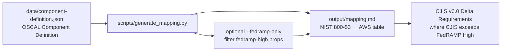

# NIST 800-53 Rev 5 to AWS Service Mapping

Maps NIST 800-53 Rev 5 security controls to AWS services that support their implementation, stored as an OSCAL Component Definition JSON file. A Python generator script renders the mapping as markdown with FedRAMP High baseline filtering and a CJIS v6.0 delta section highlighting where CJIS exceeds FedRAMP requirements. Built for GRC engineers, compliance analysts, and assessors working in FedRAMP High and CJIS v6.0 environments.

## Architecture Overview



Editable Mermaid source (kept in sync with the fence above): [`docs/architecture.mmd`](docs/architecture.mmd).

The OSCAL Component Definition at `data/component-definition.json` is the machine-readable mapping source (control implementations with AWS service props, including `fedramp-high` and `cjis-delta`). `scripts/generate_mapping.py` reads that JSON and writes `output/mapping.md`. Pass `--fedramp-only` to emit only FedRAMP High controls; the markdown adds a CJIS v6.0 delta section listing controls with a `cjis-delta` prop (under `--fedramp-only`, the delta section is likewise restricted to FedRAMP High controls).

## Compliance Controls Addressed

| NIST 800-53 Rev 5 | FedRAMP High | CJIS v6.0 | Validation Method |
|--------------------|:------------:|:---------:|-------------------|
| AC-2 Account Management | Yes | Quarterly CJI access reviews | OSCAL prop mapping |
| AC-3 Access Enforcement | Yes | — | OSCAL prop mapping |
| AC-6 Least Privilege | Yes | — | OSCAL prop mapping |
| AC-17 Remote Access | Yes | — | OSCAL prop mapping |
| AU-2 Event Logging | Yes | — | OSCAL prop mapping |
| AU-3 Content of Audit Records | Yes | — | OSCAL prop mapping |
| AU-6 Audit Record Review | Yes | 1-year retention, weekly review | OSCAL prop mapping |
| AU-6(1) Automated Integration | Yes | — | OSCAL prop mapping |
| AU-9 Protection of Audit Info | Yes | — | OSCAL prop mapping |
| AU-12 Audit Record Generation | Yes | — | OSCAL prop mapping |
| CM-2 Baseline Configuration | Yes | — | OSCAL prop mapping |
| CM-3 Configuration Change Control | Yes | — | OSCAL prop mapping |
| CM-6 Configuration Settings | Yes | — | OSCAL prop mapping |
| CM-7 Least Functionality | Yes | — | OSCAL prop mapping |
| CM-8 System Component Inventory | Yes | — | OSCAL prop mapping |
| IA-2 Identification & Authentication | Yes | AAL2 phishing-resistant MFA | OSCAL prop mapping |
| IA-5 Authenticator Management | Yes | — | OSCAL prop mapping |
| IA-8 Non-Organizational Users | Yes | — | OSCAL prop mapping |
| IR-4 Incident Handling | Yes | — | OSCAL prop mapping |
| IR-5 Incident Monitoring | Yes | — | OSCAL prop mapping |
| IR-6 Incident Reporting | Yes | CSO/FBI CJIS Division reporting | OSCAL prop mapping |
| SC-7 Boundary Protection | Yes | — | OSCAL prop mapping |
| SC-8 Transmission Confidentiality | Yes | — | OSCAL prop mapping |
| SC-12 Cryptographic Key Management | Yes | — | OSCAL prop mapping |
| SC-13 Cryptographic Protection | Yes | — | OSCAL prop mapping |
| SC-28 Protection of Info at Rest | Yes | Agency-managed CMK required | OSCAL prop mapping |
| SC-28(1) Cryptographic Protection | Yes | — | OSCAL prop mapping |
| SI-2 Flaw Remediation | Yes | — | OSCAL prop mapping |
| SI-3 Malicious Code Protection | Yes | — | OSCAL prop mapping |
| SI-4 System Monitoring | Yes | — | OSCAL prop mapping |
| SI-7 Software/Firmware Integrity | Yes | — | OSCAL prop mapping |

## How to Run the Generator

```bash
# Generate the full mapping (all controls)
python3 scripts/generate_mapping.py --input data/component-definition.json --output output/mapping.md

# Generate FedRAMP High baseline only
python3 scripts/generate_mapping.py --input data/component-definition.json --output output/mapping.md --fedramp-only
```

## How an Auditor Uses This Output

The generated mapping document shows which AWS services satisfy each NIST 800-53 control and how. An assessor reviewing a FedRAMP High authorization package can use the `--fedramp-only` output to verify that every in-scope control has a documented AWS service implementation. The CJIS v6.0 Delta Requirements section at the bottom identifies the specific controls where a law enforcement agency's deployment must exceed the FedRAMP High baseline.

## FedRAMP 20x Alignment

The OSCAL Component Definition format aligns with FedRAMP 20x compliance-as-code requirements. The structured JSON data source can feed directly into automated validation pipelines (e.g., compliance-trestle, OSCAL-based tooling) and continuous monitoring workflows. This is the same machine-readable format that FedRAMP 20x will require for compliance submissions.

## CJIS v6.0 Relevance

CJIS v6.0 (published Dec 27, 2024) aligns to NIST 800-53 Rev 5 and phases in rather than switching on a single date: v5.9.5 was the scored audit standard through March 31, 2026 and v6.0 is the default audit baseline from April 1, 2026, with modernized Priority 2-4 controls fully enforceable Oct 1, 2027 (timing varies by state CSA). This mapping identifies 5 controls where CJIS exceeds FedRAMP High: quarterly account reviews (AC-2), phishing-resistant AAL2 MFA (IA-2), 1-year audit log retention with weekly review (AU-6), agency-managed encryption keys (SC-28), and incident reporting to the CSO/FBI CJIS Division (IR-6).

## Sample Evidence Output

See the generated mapping: [`output/mapping.md`](output/mapping.md)

## Project Structure

```
├── data/
│   └── component-definition.json   # OSCAL Component Definition source
├── scripts/
│   └── generate_mapping.py         # Python generator (OSCAL → markdown)
├── output/
│   └── mapping.md                  # Generated mapping document
├── docs/
│   └── architecture.mmd            # Mermaid source (sync with README fence)
├── CLAUDE.md
├── README.md
└── LICENSE.txt
```

## License

MIT
